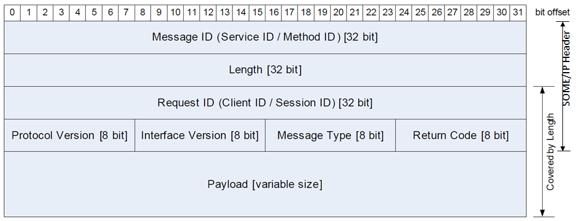

我们在遇到比较罕见/自定义的通信协议的时候，可能nuget上并没有相关的包来处理，需要自己写（反）序列化程序。
此时如果为每个类型的消息都单独解析就显得麻烦了。Source Generator 就能很好解决这个问题。

> A Source Generator is a new kind of component that C# developers can write that lets you do two major things:
> 1. Retrieve a compilation object that represents all user code that is being compiled. This object can be inspected, and you can write code that works with the syntax and semantic models for the code being compiled, just like with analyzers today.
> 2. Generate C# source files that can be added to a compilation object during compilation. In other words, you can provide additional source code as input to a compilation while the code is being compiled.

## 单个消息的封送

拿 [SOME/IP(Scalable service-Oriented MiddlewarE over IP)](https://www.autosar.org/fileadmin/standards/R22-11/FO/AUTOSAR_PRS_SOMEIPProtocol.pdf) 协议为例:

我们可以很快用struct表示出它的结构:
```C#
public partial struct SomeIpMessage
{
    
    public Header Header;
    public uint Length;
    public RequestId RequestId;
    public ProtocolInfo ProtocolInfo;
    
    public byte[] PayLoad;
}
public partial struct ProtocolInfo
{
    public byte ProtocolVersion;
    public byte InterfaceVersion;
    public byte MessageType;
    public byte ReturnCode;

}
public partial struct RequestId
{
    public UInt16 ClientId;
    public UInt16 SessionId;
}
public partial struct Header
{
    public UInt16 ServiceId;
    public UInt16 MethodId;
}
```
这里也有一个示例数据（大端存储）：
```
0000   50 03 80 01 00 00 00 45 00 00 00 00 01 01 02 00   P......E........
0010   00 00 00 39 00 00 00 00 00 00 00 00 00 00 00 00   ...9............
0020   00 00 00 00 00 00 00 00 00 00 00 00 00 00 00 00   ................
0030   00 00 00 00 00 00 00 00 00 00 00 00 00 00 00 00   ................
0040   00 00 00 00 00 00 00 00 00 00 00 00 00            .............
```
同时我们也可以很容易写出读写的方法 (以 Header 为例) ：
```C#
public partial struct Header
{
    public UInt16 ServiceId;
    public UInt16 MethodId;

    public Header Deserialize(byte[] data)
    {
        var position = 0;

        this.ServiceId = BinaryPrimitives.ReadUInt16BigEndian(data.AsSpan(position));
        position += sizeof(UInt16);
        this.MethodId = BinaryPrimitives.ReadUInt16BigEndian(data.AsSpan(position));
        position += sizeof(UInt16);

        return this;
    }

    public byte[] Serialize()
    {
        var data = new byte[GetSize()];

        var position = 0;
        BinaryPrimitives.WriteUInt16BigEndian(data.AsSpan(position), this.ServiceId);
        position += sizeof(UInt16);
        BinaryPrimitives.WriteUInt16BigEndian(data.AsSpan(position), this.MethodId);
        position += sizeof(UInt16);
        
        return data;
    }

    public int GetSize()
    {
        return 0 + sizeof(UInt16) + sizeof(UInt16);
    }
}


// Usage:
var sampleData = Convert.FromBase64String("UAOAAQAAAEUAAAAAAQECAAAAADkAAAAAAAAAAAAAAAAAAAAAAAAAAAAAAAAAAAAAAAAAAAAAAAAAAAAAAAAAAAAAAAAAAAAAAAAAAAA=");
var rawHeader = sampleData.AsSpan(0,4).ToArray();

var header = new Header().Deserialize(rawHeader);
var newHeader = header.Serialize();

Enumerable.SequenceEqual(rawHeader,newHeader); // true
```


对于 byte[] 类型来说，它的长度可以由 (总大小-其它成员的大小)/sizeof(byte) 取得:
```C#
public byte[] ReadFromBytes(byte[] _, byte[] srcBytes, ref int startIndex, bool isBigEndian, object parent)
{
    var arrayLength = (srcBytes.Length - startIndex) / sizeof(byte);
    int byteCount = arrayLength * sizeof(byte);

    var result = new byte[arrayLength];

    Buffer.BlockCopy(srcBytes, startIndex, result, 0, byteCount);
    startIndex += byteCount;

    return result;
}
```


## 制作思路
为了自动生成封送代码，我们可以分成下面几个步骤：
1. 寻找所有需要实现的 struct
2. 遍历 struct 的每个成员
3. 生成实现 (反)序列化 相关的代码


## 创建二进制处理的辅助项目
创建 .net standard 2.0 类库 StructPacker.Tools
定义封送的接口
```C#
public interface IPackable<out T>:ISizeInfo
{
    T Deserialize(byte[] sourceData,bool isBigEndian=true, int startIndex = 0);

    byte[] Serialize(bool isBigEndian=true);
}

public interface ISizeInfo
{
    int GetSize();
}
```
定义相关 Attributes：  
PackableAttribute 用来表示需要处理的 struct  
PackIgnoreAttribute 用于忽略不需要处理的成员
```C#
[AttributeUsage(AttributeTargets.Struct)]
public class PackableAttribute:Attribute
{
    
}
[AttributeUsage(AttributeTargets.Field|AttributeTargets.Property)]
public class PackIgnoreAttribute : Attribute
{
    
}

```


添加二进制数据读方法
<details> <summary>BinaryUtils.Readers.cs</summary>

```C#
public partial class BinaryUtils
{
    #region private methods

    private static short ReadInt16(byte[] srcBytes, ref int startIndex, bool isBigEndian)
    {
        var value = isBigEndian
            ? BinaryPrimitives.ReadInt16BigEndian(srcBytes.AsSpan(startIndex))
            : BinaryPrimitives.ReadInt16LittleEndian(srcBytes.AsSpan(startIndex));
        startIndex += sizeof(Int16);
        return value;
    }

    private static ushort ReadUInt16(byte[] srcBytes, ref int startIndex, bool isBigEndian)
    {
        var value = isBigEndian
            ? BinaryPrimitives.ReadUInt16BigEndian(srcBytes.AsSpan(startIndex))
            : BinaryPrimitives.ReadUInt16LittleEndian(srcBytes.AsSpan(startIndex));
        startIndex += sizeof(Int16);
        return value;
    }

    private static int ReadInt32(byte[] srcBytes, ref int startIndex, bool isBigEndian)
    {
        var value = isBigEndian
            ? BinaryPrimitives.ReadInt32BigEndian(srcBytes.AsSpan(startIndex))
            : BinaryPrimitives.ReadInt32LittleEndian(srcBytes.AsSpan(startIndex));
        startIndex += sizeof(Int32);
        return value;
    }

    private static uint ReadUInt32(byte[] srcBytes, ref int startIndex, bool isBigEndian)
    {
        var value = isBigEndian
            ? BinaryPrimitives.ReadUInt32BigEndian(srcBytes.AsSpan(startIndex))
            : BinaryPrimitives.ReadUInt32LittleEndian(srcBytes.AsSpan(startIndex));
        startIndex += sizeof(UInt32);
        return value;
    }

    private static Int64 ReadInt64(byte[] srcBytes, ref int startIndex, bool isBigEndian)
    {
        var value = isBigEndian
            ? BinaryPrimitives.ReadInt64BigEndian(srcBytes.AsSpan(startIndex))
            : BinaryPrimitives.ReadInt64LittleEndian(srcBytes.AsSpan(startIndex));
        startIndex += sizeof(Int64);
        return value;
    }

    private static UInt64 ReadUInt64(byte[] srcBytes, ref int startIndex, bool isBigEndian)
    {
        var value = isBigEndian
            ? BinaryPrimitives.ReadUInt64BigEndian(srcBytes.AsSpan(startIndex))
            : BinaryPrimitives.ReadUInt64LittleEndian(srcBytes.AsSpan(startIndex));
        startIndex += sizeof(UInt64);
        return value;
    }


    private static float ReadSingle(byte[] srcBytes, ref int startIndex, bool isBigEndian)
    {
        unsafe
        {
            int val = ReadInt32(srcBytes, ref startIndex, isBigEndian);
            return *(float*)&val;
        }
    }

    private static double ReadDouble(byte[] value, ref int index, bool isBigEndian)
    {
        unsafe
        {
            long val = ReadInt64(value, ref index, isBigEndian);
            return *(double*)&val;
        }
    }

    private static decimal ReadDecimal(byte[] value, ref int index, bool isBigEndian)
    {
        if (isBigEndian)
        {
            throw new NotImplementedException();
        }

        unsafe
        {
            fixed (byte* pbyte = &value[index])
            {
                index += sizeof(decimal);
                return *((decimal*)pbyte);
            }
        }
    }

    #endregion

    public static T ReadFromBytes<T>(T _, byte[] srcBytes, ref int startIndex, bool isBigEndian)
        where T : IPackable<T>, new()
    {
        var obj = new T();
        obj.Deserialize(srcBytes, isBigEndian, startIndex);
        startIndex += obj.GetSize();
        return obj;
    }

    public static bool ReadFromBytes(bool _, byte[] srcBytes, ref int startIndex, bool isBigEndian)
    {
        return srcBytes[startIndex++] switch
        {
            FlagTrue => true,
            FlagFalse => false,
            _ => throw new ArgumentOutOfRangeException()
        };
    }

    public static byte ReadFromBytes(byte _, byte[] srcBytes, ref int startIndex, bool isBigEndian) =>
        srcBytes[startIndex++];

    public static sbyte ReadFromBytes(sbyte _, byte[] srcBytes, ref int startIndex, bool isBigEndian) =>
        (sbyte)srcBytes[startIndex++];

    public static char ReadFromBytes(char _, byte[] srcBytes, ref int startIndex, bool isBigEndian)
    {
        return (char)ReadInt16(srcBytes, ref startIndex, isBigEndian);
    }

    public static short ReadFromBytes(short _, byte[] srcBytes, ref int startIndex, bool isBigEndian) =>
        ReadInt16(srcBytes, ref startIndex, isBigEndian);

    public static ushort ReadFromBytes(ushort _, byte[] srcBytes, ref int startIndex, bool isBigEndian) =>
        ReadUInt16(srcBytes, ref startIndex, isBigEndian);

    public static int ReadFromBytes(int _, byte[] srcBytes, ref int startIndex, bool isBigEndian) =>
        ReadInt32(srcBytes, ref startIndex, isBigEndian);

    public static uint ReadFromBytes(uint _, byte[] srcBytes, ref int startIndex, bool isBigEndian) =>
        ReadUInt32(srcBytes, ref startIndex, isBigEndian);

    public static long ReadFromBytes(long _, byte[] srcBytes, ref int startIndex, bool isBigEndian) =>
        ReadInt64(srcBytes, ref startIndex, isBigEndian);

    public static ulong ReadFromBytes(ulong _, byte[] srcBytes, ref int startIndex, bool isBigEndian) =>
        ReadUInt64(srcBytes, ref startIndex, isBigEndian);

    public static float ReadFromBytes(float _, byte[] srcBytes, ref int startIndex, bool isBigEndian) =>
        ReadSingle(srcBytes, ref startIndex, isBigEndian);

    public static double ReadFromBytes(double _, byte[] srcBytes, ref int startIndex, bool isBigEndian) =>
        ReadDouble(srcBytes, ref startIndex, isBigEndian);

    public static decimal ReadFromBytes(decimal _, byte[] srcBytes, ref int startIndex, bool isBigEndian) =>
        ReadDecimal(srcBytes, ref startIndex, isBigEndian);
}
```

</details>


添加二进制数据写方法  
<details> <summary>BinaryUtils.Writers.cs</summary>

```C#
public partial class BinaryUtils
{
    #region private methods

    
    private static void WriteInt16(short value, byte[] targetBytes, ref int index, bool isBigEndian)
    {
        if (isBigEndian)
            BinaryPrimitives.WriteInt16BigEndian(targetBytes.AsSpan(index), value);
        else
            BinaryPrimitives.WriteInt16LittleEndian(targetBytes.AsSpan(index), value);
        
        index += sizeof(short);
    }
    
    private static void WriteUInt16(ushort value, byte[] targetBytes, ref int index, bool isBigEndian)
    {
        if (isBigEndian)
            BinaryPrimitives.WriteUInt16BigEndian(targetBytes.AsSpan(index), value);
        else
            BinaryPrimitives.WriteUInt16LittleEndian(targetBytes.AsSpan(index), value);
        
        index += sizeof(ushort);
    }
    
    private static void WriteInt32(int value, byte[] targetBytes, ref int index, bool isBigEndian)
    {
        if (isBigEndian)
            BinaryPrimitives.WriteInt32BigEndian(targetBytes.AsSpan(index), value);
        else
            BinaryPrimitives.WriteInt32LittleEndian(targetBytes.AsSpan(index), value);
        
        index += sizeof(int);
    }
    private static void UWriteInt32(uint value, byte[] targetBytes, ref int index, bool isBigEndian)
    {
        if (isBigEndian)
            BinaryPrimitives.WriteUInt32BigEndian(targetBytes.AsSpan(index), value);
        else
            BinaryPrimitives.WriteUInt32LittleEndian(targetBytes.AsSpan(index), value);
        
        index += sizeof(uint);
    }
    private static void WriteInt64(long value, byte[] targetBytes, ref int index, bool isBigEndian)
    {
        if (isBigEndian)
            BinaryPrimitives.WriteInt64BigEndian(targetBytes.AsSpan(index), value);
        else
            BinaryPrimitives.WriteInt64LittleEndian(targetBytes.AsSpan(index), value);
        
        index += sizeof(long);
    }
    private static void UWriteInt64(ulong value, byte[] targetBytes, ref int index, bool isBigEndian)
    {
        if (isBigEndian)
            BinaryPrimitives.WriteUInt64BigEndian(targetBytes.AsSpan(index), value);
        else
            BinaryPrimitives.WriteUInt64LittleEndian(targetBytes.AsSpan(index), value);
        
        index += sizeof(ulong);
    }

    #endregion

    
    
    public static void Write<T>(T obj, byte[] targetBytes, ref int index, bool isBigEndian) where T : IPackable<T>, new()
    {
        var data1 = obj.Serialize(isBigEndian);
        data1.CopyTo(targetBytes, index);
        index += data1.Length;
    }

    public static void Write<T>(T[] obj, byte[] targetBytes, ref int index, bool isBigEndian) where T : IPackable<T>, new()
    {
        foreach (var item in obj)
        {
            var data1 = item.Serialize(isBigEndian);
            data1.CopyTo(targetBytes, index);
            index += data1.Length;
        }
    }


    public static void Write(bool value, byte[] targetBytes, ref int index, bool isBigEndian) =>
        targetBytes[index++] = value ? FlagTrue : FlagFalse;

    public static void Write(byte value, byte[] targetBytes, ref int index, bool isBigEndian) => targetBytes[index++] = value;
    public static void Write(sbyte value, byte[] targetBytes, ref int index, bool isBigEndian) => targetBytes[index++] = (byte)value;

    public static void Write(char value, byte[] targetBytes, ref int index, bool isBigEndian) =>
        WriteInt16((short)value, targetBytes, ref index, isBigEndian);

    public static void Write(short value, byte[] targetBytes, ref int index, bool isBigEndian) =>
        WriteInt16(value, targetBytes, ref index, isBigEndian);

    public static void Write(ushort value, byte[] targetBytes, ref int index, bool isBigEndian) =>
        WriteInt16((short)value, targetBytes, ref index, isBigEndian);

    public static void Write(int value, byte[] targetBytes, ref int index, bool isBigEndian) =>
        WriteInt32(value, targetBytes, ref index, isBigEndian);

    public static void Write(uint value, byte[] targetBytes, ref int index, bool isBigEndian) =>
        WriteInt32((int)value, targetBytes, ref index, isBigEndian);

    public static void Write(long value, byte[] targetBytes, ref int index, bool isBigEndian) =>
        WriteInt64(value, targetBytes, ref index, isBigEndian);

    public static void Write(ulong value, byte[] targetBytes, ref int index, bool isBigEndian) =>
        WriteInt64((long)value, targetBytes, ref index, isBigEndian);

    public static void Write(float value, byte[] targetBytes, ref int index, bool isBigEndian)
    {
        unsafe
        {
            WriteInt32(*(int*)&value, targetBytes, ref index, isBigEndian);
        }
    }

    public static void Write(double value, byte[] targetBytes, ref int index, bool isBigEndian)
    {
        unsafe
        {
            WriteInt64(*(long*)&value, targetBytes, ref index, isBigEndian);
        }
    }

    public static void Write(byte[] value, byte[] targetBytes,ref int index, bool isBigEndian)
    {
        int byteCount = value.Length * sizeof(byte);
        Buffer.BlockCopy(value, 0, targetBytes, index, byteCount);
        index += byteCount;
    }
}
```

</details>


对于数组类型的数据，由于不同的协议中处理的方法不同，因此可以考虑单独开放自定义数组处理方法
```C#
[AttributeUsage(AttributeTargets.Field|AttributeTargets.Property)]
public class CustomBinaryConvertorAttribute : Attribute 
{
public CustomBinaryConvertorAttribute(Type convertorType)
{
    ConvertorType = convertorType;
}
public Type ConvertorType { get; }
}
```
定义自定义转换器的接口
```C#
public interface IArrayBinaryConvertor<T>
{
    public T[] ReadFromBytes(T[] _, byte[] srcBytes, ref int startIndex, bool isBigEndian,object parent);

    public void Write(T[] obj, byte[] targetBytes, ref int index, bool isBigEndian);
}
```
保存自定义转换器  ：
BinaryUtils.cs
```C#
private static readonly Encoding StringEncoding = Encoding.UTF8;

private static readonly Dictionary<Type, object> CustomConvertors = new();
public static T GetConvertor<T>() where T: class
{
    if (CustomConvertors.ContainsKey(typeof(T)))
    {
        return CustomConvertors[typeof(T)] as T;
    }
    else
    {
        var instance = Activator.CreateInstance<T>();
        CustomConvertors.Add(typeof(T),instance);
        return instance;
    }
}
```

下面我们就可以尝试手动实现一下  
假设当前有一个测试结构体 StructA
```C#
public partial struct StructA
{
    public int Id;
    [CustomBinaryConvertor(typeof(AutoSizeArrayConvertor))]
    public byte[] Data;
}
```
实现 `IPackable<TestStruct>` 接口
```C#
public partial struct StructA: IPackable<TestStruct>
{   
    public int GetSize()=>0 + BinaryUtils.GetSize(Id) + BinaryUtils.GetSize(Data);

    public byte[] Serialize(bool isBigEndian=true)
    {
        var destBytes = new byte[GetSize()];
        int startIndex = 0;
        // 默认
        BinaryUtils.Write(Id, destBytes, ref startIndex, isBigEndian);
        
        // 自定义转换器
        BinaryUtils.GetConvertor<AutoSizeArrayConvertor>().Write(Data, destBytes, ref startIndex, isBigEndian);
        
        return destBytes;
    }
    public TestStruct Deserialize(byte[] sourceData, bool isBigEndian=true, int startIndex = 0)
    {
        // 默认
        Id = BinaryUtils.ReadFromBytes(Id, sourceData, ref startIndex, isBigEndian);
        
        // 自定义转换器
        Data =  BinaryUtils.GetConvertor<StructPacker.Tests.AutoSizeArrayConvertor>().ReadFromBytes(Data, sourceData, ref startIndex, isBigEndian, this);

        return this;
    }
}
```
处理自动长度的数组
```C#
public class AutoSizeArrayConvertor:IArrayBinaryConvertor<byte>
{
    public byte[] ReadFromBytes(byte[] _, byte[] srcBytes, ref int startIndex, bool isBigEndian, object parent)
    {
        var arrayLength = (srcBytes.Length - startIndex) / sizeof(byte);
        int byteCount = arrayLength * sizeof(byte);

        var result = new byte[arrayLength];

        Buffer.BlockCopy(srcBytes, startIndex, result, 0, byteCount);
        startIndex += byteCount;

        return result;
       
    }

    public void Write(byte[] obj, byte[] targetBytes, ref int index, bool isBigEndian)
    {
        BinaryUtils.Write(obj, targetBytes, ref index, isBigEndian);
    }
}
```

之后就可以尝试编写 Source Generator 了！


## 创建Source Generator项目

创建 .net standard 2.0 类库 StructPacker 并且添加nuget包:
```xml
<ItemGroup>
    <PackageReference Include="Microsoft.CodeAnalysis.CSharp" Version="4.8.0" PrivateAssets="all" />
    <PackageReference Include="Microsoft.CodeAnalysis.Analyzers" Version="3.3.4" PrivateAssets="all" />
</ItemGroup>
```
实现 [ISyntaxReceiver](https://learn.microsoft.com/en-us/dotnet/api/microsoft.codeanalysis.isyntaxreceiver?view=roslyn-dotnet-4.7.0)
> The ISyntaxReceiver can record any information about the nodes visited. During Execute(GeneratorExecutionContext) the generator can obtain the created instance via the SyntaxReceiver property. The information contained can be used to perform final generation.

```C#
public class StructReceiver:ISyntaxReceiver
{
    public List<StructDeclarationSyntax> PackableStructItems { get; } = new();
    
    public void OnVisitSyntaxNode(SyntaxNode syntaxNode)
    {
        if (syntaxNode is StructDeclarationSyntax decSyntax)
        {
            if (decSyntax.AttributeLists.Any(x=>x.Attributes.Any(y=> y.ToFullString()== "Packable")))
            {
                PackableStructItems.Add(decSyntax);
            }
        }
    }
}
```

实现 [ISourceGenerator](https://learn.microsoft.com/en-us/dotnet/api/microsoft.codeanalysis.isourcegenerator?view=roslyn-dotnet-4.7.0)

<details> <summary>StructPackerGenerator.cs</summary>

```C#
[Generator]
public class StructPackerGenerator : ISourceGenerator
{
    private const string AttributeNamespace = "StructPacker.Tools.Attributes";
    
    public void Initialize(GeneratorInitializationContext context)
    {
        context.RegisterForSyntaxNotifications(() => new StructReceiver());
    }

    public void Execute(GeneratorExecutionContext context)
    {
        var receiver = (StructReceiver)context.SyntaxReceiver;

        if (receiver == null || receiver.PackableStructItems.Count == 0)
            return;
        try
        {
            GenerateSourceFile(receiver.PackableStructItems, context);
        }
        catch (Exception e)
        {
            var diag = Diagnostic.Create("RKSPE", "StructPacker", $"StructPacker: {e.Message}",
                DiagnosticSeverity.Error, DiagnosticSeverity.Error, true, 0);
            context.ReportDiagnostic(diag);
        }
    }

    private void GenerateSourceFile(List<StructDeclarationSyntax> inputStructs, GeneratorExecutionContext context)
    {
        foreach (StructDeclarationSyntax declaration in inputStructs)
        {
            string code = GenerateCode(declaration, context);
            if (string.IsNullOrEmpty(code))
            {
                continue;
            }
            context.AddSource($"{GetNamespace(declaration)}.{declaration.Identifier.Text}.g.cs", code);
        }
    }

    private string GenerateCode(TypeDeclarationSyntax declaration, GeneratorExecutionContext context)
    {
        var code = new CodeGen();
        code.AppendUsings("StructPacker.Tools");
        code.AppendUsings("StructPacker.Tools.Utils");
        code.Line();
        code.BeginNamespace(GetNamespace(declaration));
        SemanticModel model = context.Compilation.GetSemanticModel(declaration.SyntaxTree);

        ISymbol decSymb = ModelExtensions.GetDeclaredSymbol(model, declaration);
        string classFqn = decSymb?.ToDisplayString(SymbolDisplayFormat.FullyQualifiedFormat);
        if (string.IsNullOrWhiteSpace(classFqn))
            return null;

        var fields = new List<StructFieldInfo>();

        foreach (PropertyDeclarationSyntax p in declaration.Members.OfType<PropertyDeclarationSyntax>())
        {
            if (HasAttribute(p.AttributeLists, $"{AttributeNamespace}.PackIgnoreAttribute", model, context))
                continue;

            if (p.Modifiers.Any(m => m.IsKind(SyntaxKind.PrivateKeyword)))
                continue;

            AccessorDeclarationSyntax getter =
                p.AccessorList?.Accessors.FirstOrDefault(x => x.IsKind(SyntaxKind.GetAccessorDeclaration));
            AccessorDeclarationSyntax setter =
                p.AccessorList?.Accessors.FirstOrDefault(x => x.IsKind(SyntaxKind.SetAccessorDeclaration));

            if (getter == null || setter == null)
                throw new Exception(
                    $"Type \"{classFqn}\" has properties with missing \"get\" or \"set\" accessors and cannot be serialized. Add missing accessors or skip serializing this property with \"SkipPack\" attribute if this is intentional.");

            if (getter.Modifiers.Any(m => m.IsKind(SyntaxKind.PrivateKeyword)) ||
                setter.Modifiers.Any(m => m.IsKind(SyntaxKind.PrivateKeyword)))
                throw new Exception(
                    $"Type \"{classFqn}\" has properties with \"get\" or \"set\" accessors marked as private and cannot be serialized. Remove private modifier or skip serializing this property with \"SkipPack\" attribute if this is intentional.");

            fields.Add(new StructFieldInfo(p.Identifier.Text,GetConverterType(p,model)));
        }

        foreach (FieldDeclarationSyntax p in declaration.Members.OfType<FieldDeclarationSyntax>())
        {
            if (HasAttribute(p.AttributeLists, $"{AttributeNamespace}.PackIgnoreAttribute", model, context))
                continue;

            if (p.Modifiers.Any(m => m.IsKind(SyntaxKind.PrivateKeyword)))
                continue;

            foreach (VariableDeclaratorSyntax varSyn in p.Declaration.Variables)
                fields.Add(new StructFieldInfo(varSyn.Identifier.Text,GetConverterType(p,model)));
        }

        Generate(declaration.Identifier.Text, fields, code);
        return code.ToString();
    }

    private void Generate(string identifier, List<StructFieldInfo> fields, CodeGen code)
    {
        
        if (fields.Count == 0)
            throw new Exception(
                $"Type \"{identifier}\" does not contain any valid members. Serializing empty types is meaningless as they take zero bytes. Add some members or exclude this type from serialization.");
        
        code.Line($"public partial struct {identifier}:IPackable<{identifier}>");
        code.BeginCodeBlock();
        
        // Implement GetSize
        code.Line($"public int GetSize()=>0");
        foreach (var id in fields)
        {
            code.Append($" + {FqnTools}.GetSize({id.StructName})");            
        }
        code.Append(";");
        code.Line("");
        // Implement Serialize
        code.Line($"public byte[] Serialize(bool isBigEndian=true)");
        code.BeginCodeBlock();
        code.Line("var destBytes = new byte[GetSize()];");
        code.Line("int startIndex = 0;");
        
        foreach (var id in fields)
        {
            if (id.Convertor!=null)
            {
                code.Line($"{FqnTools}.GetConvertor<{id.Convertor}>().Write({id.StructName}, destBytes, ref startIndex, isBigEndian);");
            }
            else
            {
                code.Line($"{FqnTools}.Write({id.StructName}, destBytes, ref startIndex, isBigEndian);");
            }
        }

        code.Line("return destBytes;");
        code.EndCodeBlock();

        // Implement Deserialize
        code.Line($"public {identifier} Deserialize(byte[] sourceData, bool isBigEndian=true, int startIndex = 0)");
        code.BeginCodeBlock();

        foreach (var id in fields)
        {
            if (id.Convertor!=null)
            {
                code.Line($"{id.StructName} = {FqnTools}.GetConvertor<{id.Convertor}>().ReadFromBytes({id.StructName}, sourceData, ref startIndex, isBigEndian, this);");

            }
            else
            {
                code.Line(
                    $"{id.StructName} = {FqnTools}.ReadFromBytes({id.StructName}, sourceData, ref startIndex, isBigEndian);");
            }
        }

        code.Line($"return this;");

        code.EndCodeBlock();


        //end


        code.EndCodeBlock();
        code.EndCodeBlock();

        
        
    }

    private const string FqnTools = "BinaryUtils";


    #region SyntaxUtils
    
    // Custom converter
    private ITypeSymbol? GetConverterType(PropertyDeclarationSyntax field,SemanticModel semanticModel)
    {
        var attributes = field.AttributeLists;
        foreach (var attribute in attributes)
        {
            foreach (var attributeAttribute in attribute.Attributes)
            {
                if (attributeAttribute.Name.ToFullString() == "CustomBinaryConvertor")
                {            
                    AttributeArgumentSyntax firstArgument = attributeAttribute.ArgumentList.Arguments.First();

                    var typeExpressionSyntax = firstArgument.Expression as TypeOfExpressionSyntax;
                    if (typeExpressionSyntax == null)
                    {
                        return null;
                    }

                    // Parse convertor type from the syntax tree
                    var typeInfo = semanticModel.GetTypeInfo(typeExpressionSyntax.Type);

                    return typeInfo.Type;

                }
            }
        }
        
        return null;
    }
    
    private ITypeSymbol? GetConverterType(FieldDeclarationSyntax field,SemanticModel semanticModel)
    {
        var attributes = field.AttributeLists;
        foreach (var attribute in attributes)
        {
            foreach (var attributeAttribute in attribute.Attributes)
            {
                if (attributeAttribute.Name.ToFullString() == "CustomBinaryConvertor")
                {            
                    AttributeArgumentSyntax firstArgument = attributeAttribute.ArgumentList.Arguments.First();

                    // var value = firstArgument.Expression.NormalizeWhitespace().ToFullString();
                    var typeExpressionSyntax = firstArgument.Expression as TypeOfExpressionSyntax;
                    if (typeExpressionSyntax == null)
                    {
                        return null;
                    }

                    // Parse convertor type from the syntax tree
                    var typeInfo = semanticModel.GetTypeInfo(typeExpressionSyntax.Type);

                    return typeInfo.Type;

                }
            }
        }
        
        return null;
    }
    
    

    internal static readonly SymbolDisplayFormat TypeNameFormat = new(
        SymbolDisplayGlobalNamespaceStyle.Omitted,
        SymbolDisplayTypeQualificationStyle.NameAndContainingTypesAndNamespaces);

    internal static bool HasAttribute(SyntaxList<AttributeListSyntax> source, string fullName, SemanticModel model,
        GeneratorExecutionContext ctx)
    {
        return source.SelectMany(list => list.Attributes).Any(
            atr =>
            {
                TypeInfo typeInfo = ModelExtensions.GetTypeInfo(model, atr, ctx.CancellationToken);
                string typeName = typeInfo.Type?.ToDisplayString(TypeNameFormat);

                return string.Equals(typeName, fullName, StringComparison.Ordinal);
            });
    }

    // determine the namespace the class/enum/struct is declared in, if any
    // refer: https://andrewlock.net/creating-a-source-generator-part-5-finding-a-type-declarations-namespace-and-type-hierarchy/
    static string GetNamespace(BaseTypeDeclarationSyntax syntax)
    {
        // If we don't have a namespace at all we'll return an empty string
        // This accounts for the "default namespace" case
        string nameSpace = string.Empty;

        // Get the containing syntax node for the type declaration
        // (could be a nested type, for example)
        SyntaxNode? potentialNamespaceParent = syntax.Parent;

        // Keep moving "out" of nested classes etc until we get to a namespace
        // or until we run out of parents
        while (potentialNamespaceParent != null &&
                potentialNamespaceParent is not NamespaceDeclarationSyntax
                && potentialNamespaceParent is not FileScopedNamespaceDeclarationSyntax)
        {
            potentialNamespaceParent = potentialNamespaceParent.Parent;
        }

        // Build up the final namespace by looping until we no longer have a namespace declaration
        if (potentialNamespaceParent is BaseNamespaceDeclarationSyntax namespaceParent)
        {
            // We have a namespace. Use that as the type
            nameSpace = namespaceParent.Name.ToString();

            // Keep moving "out" of the namespace declarations until we 
            // run out of nested namespace declarations
            while (true)
            {
                if (namespaceParent.Parent is not NamespaceDeclarationSyntax parent)
                {
                    break;
                }

                // Add the outer namespace as a prefix to the final namespace
                nameSpace = $"{namespaceParent.Name}.{nameSpace}";
                namespaceParent = parent;
            }
        }

        // return the final namespace
        return nameSpace;
    }

    // refer: https://github.com/dotnet/roslyn/issues/28233
    // not working for this project :(
    static string GetNamespace(BaseTypeDeclarationSyntax syntax, GeneratorExecutionContext ctx)
    {
        SemanticModel semanticModel = ctx.Compilation.GetSemanticModel(syntax.SyntaxTree);
        var typeSymbol = semanticModel.GetSymbolInfo(syntax).Symbol as INamedTypeSymbol;
        if (typeSymbol is INamedTypeSymbol symbol)
        {
            return symbol.ContainingNamespace.Name;
        }

        throw new Exception($"Could not find namespace for type {syntax}");
    }

    #endregion
}
```

</details>


## 使用 SourceGenerator

创建单元测试项目 StructPacker.Tests

引用 刚写好的 StructPacker:
```xml
<ItemGroup>
    <ProjectReference Include="..\StructPacker.Tools\StructPacker.Tools.csproj" />
    <ProjectReference Include="..\StructPacker\StructPacker.csproj" OutputItemType="Analyzer" ReferenceOutputAssembly="false" />
</ItemGroup>
```


```C#

[TestMethod]
public void TestSomeIpMessage()
{
    var sampleMsg = Convert.FromBase64String("UAOAAQAAAEUAAAAAAQECAAAAADkAAAAAAAAAAAAAAAAAAAAAAAAAAAAAAAAAAAAAAAAAAAAAAAAAAAAAAAAAAAAAAAAAAAAAAAAAAAA=");

    var msgObj = new SomeIpMessage().Deserialize(sampleMsg);
    var newMsg = msgObj.Serialize();

    var ret = sampleMsg.SequenceEqual(newMsg); 
    Assert.IsTrue(ret,"Compare raw and new data."); // true
}

```

恭喜，现在它已经可以自动实现相关的方法了！！


## 参考链接
[source-generators-overview](https://learn.microsoft.com/en-us/dotnet/csharp/roslyn-sdk/source-generators-overview)  
[RudolfKurkaMs/StructPacker](https://github.com/RudolfKurkaMs/StructPacker)  
[C# Source Generators: Getting Started](https://medium.com/@araxis/c-source-generators-getting-started-bcea0d88db5)  
[Get attribute arguments with roslyn](https://stackoverflow.com/questions/49129099/get-attribute-arguments-with-roslyn)
[Finding a type declaration's namespace and type hierarchy](https://andrewlock.net/creating-a-source-generator-part-5-finding-a-type-declarations-namespace-and-type-hierarchy/)